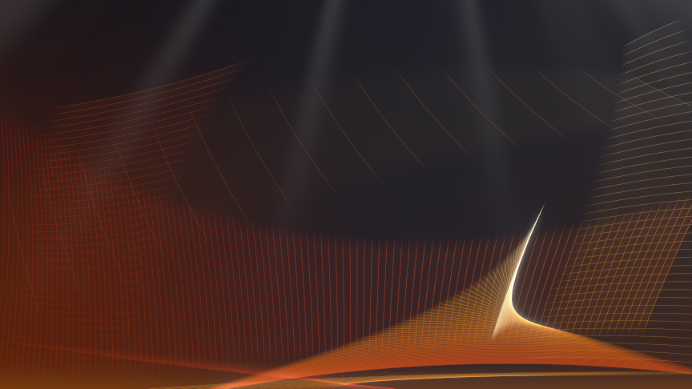

# aurora.py — Vista-style wallpaper generator

Generates Windows-Vista-"Aurora"-like wallpapers as 16-bit PNG. Everything is
computed in **linear RGB float32** and only converted to sRGB at save time, so
the large soft gradients stay band-free even at 8K.

## Setup and running

With [uv](https://docs.astral.sh/uv/) nothing needs to be prepared — it
creates the virtualenv from `pyproject.toml`/`uv.lock` on first use (and
fetches a matching Python if needed):

```
cd devel-python
git clone https://github.com/pavel-perina/aurora.git
cd aurora
uv run python aurora.py --scene ember --size 864x486
uv run python aurora.py --scene orchid --size 7680x4320 --density 1.3 --seed 5
./render_all.sh                  # all five presets in 4K (uses uv)
```

Result of the first command (8bit to save space)




Without uv, install the three dependencies into any environment and run the
script directly — it is a plain script, not a package:

```
python3 -m venv .venv && . .venv/bin/activate
pip install numpy scipy opencv-python-headless
python aurora.py --scene vista --preview
```

| flag        | meaning                                                        |
|-------------|----------------------------------------------------------------|
| `--scene`   | preset: `vista`, `bronze`, `ember`, `orchid`, `glacier`        |
| `--size`    | output resolution, e.g. `3840x2160`                            |
| `--ss`      | supersampling factor (default 2; rendering happens at size×ss) |
| `--seed`    | varies the curtain-ray pattern (only randomness in the image)  |
| `--density` | hairline-count multiplier (0.5 sparse … 1.5 busy)              |
| `--preview` | also write an 8-bit JPEG next to the PNG                       |

## Rendering pipeline

Four layers, additively composited back to front, then post-processed:

### 1. Background gradient (`render_background`)
A normalized radial-basis mix: ~5 Gaussian color "blobs" at fixed positions
(corners + center), each with a color, radius and weight. Pixel color =
weighted average of blob colors. This behaves like a smooth multi-point
gradient and cannot band because it is evaluated analytically per pixel.

### 2. Curtains (`render_curtains`)
The soft light shafts in the upper half. A 1-D random profile (Gaussian
knots, smoothed, clamped positive, raised to a `sharpness` power so only a
few beams survive) is swept across the image. Two sweep modes:

- `origin=(x, y)` with y < 0: the profile is indexed by the **angle around a
  vanishing point above the frame**, so the beams form a fan of diverging
  rays (the default; matches the original's "light from above" look).
- `origin=None`: parallel beams sheared by `shear` (the older look).

Each curtain both brightens the background multiplicatively (`strength`,
keeps hues) and adds a little white (`white`, washes toward haze). A
`(1-v)^fade_pow` term confines the rays to the top.

### 3. Ribbons — string art (`render_sheets`)
The heart of the image. A *sheet* is a family of chords between two cubic
Bezier guide curves A(t) and B(t): for t = 0…1, draw the chord A(t)→B(t).
Chords are themselves quadratic Beziers, bowed sideways by `bow`…`bow1`
(fraction of chord length), which turns flat fans into curved silk.

Chords are rasterized by sampling points along them and bilinear-splatting
into a float accumulator (`np.bincount`), i.e. **additive blending**. Two
consequences fall out for free:

- where the chord family spreads, you get airy translucent fans;
- where chords bunch up, energy accumulates into bright **envelope curves
  (caustics)** — the glowing blade and the pinch are never drawn explicitly.

Each chord's color comes from the preset palette, swept over `pal0..pal1`
as a function of t. Palettes interpolate between hex anchors in **Oklab**,
which keeps hue sweeps (yellow→cyan, purple→teal) clean instead of muddy.

Each sheet is rendered twice:
- a dense pass (`n_chords` ≈ 700–1600, `alpha` ≈ 0.005–0.03) → the smooth
  translucent wash;
- a sparse pass (`lines` ≈ 18–100, `line_alpha` ≈ 0.04–0.18) → the crisp
  hairlines you can count. `--density` scales only this pass.

`alpha` is "brightness a single chord adds per pixel it crosses", so values
are resolution-independent.

### 4. Post (`add_glow_and_bloom`, `tonemap`)
- Horizon glow: one wide additive Gaussian band centered slightly below the
  bottom edge.
- Bloom: highlights above `bloom_thresh` (clamped, so HDR caustic spikes
  don't nuke the frame) are blurred at two radii and added back.
- Tonemap: linear below a knee (0.75), smooth exponential roll-off into
  white above — this gives the hot caustic cores their soft white centers.
- Optional Oklab chroma boost (`saturate`), then sRGB encode → uint16 PNG.

Supersampling (`--ss 2`) renders everything at double resolution and
box-downsamples, which anti-aliases the hairlines.

## What is crafted vs. what is random

**Crafted (fixed in `build_scene`, shared by all presets):**
- The composition: six sheets with hand-placed Bezier guide curves —
  the big lower-left fan reaching mid-frame, the right-hand sheet whose
  chords nearly cross (guaranteeing one caustic pinch), a faint upper
  back-sheet, long bottom streaks whose guide curves run in opposite
  directions so the chords cross mid-frame, and two narrow bands climbing
  the left and right edges. The weight of the composition deliberately
  sits in the lower two-thirds of the frame.
- The background blob layout (positions/radii/weights), glow position,
  palette sweep ranges per sheet, curtain vanishing points.

**Parametric per preset (`Preset` in `PRESETS`):**
- All colors: ribbon palette anchors, backdrop, the 5 blob colors, glow.
- Intensity gains: `wash`, `line`, `curtain`, `curtain_white`,
  `glow_strength`, `bloom_thresh/strength`, `exposure`, `saturate`.
- Adding a new color scheme = adding one ~6-line `Preset` entry.
  Dark schemes want lower `wash`/`glow_strength` (additive layers have no
  bright background to hide in) and brighter palette anchors at t=0.

**Random (changes with `--seed`):**
- Only the curtain beam profile — where the rays fall and how strong each
  one is. Geometry and colors are deterministic by design, so renders are
  reproducible and the composition never degrades.

## Future idea: animation (GPU)

The design maps directly onto a GPU pipeline: background + curtains are
pure per-pixel functions (fragment shader), sheets are additive-blended
line strips into an fp16 HDR target with the Bezier control points animated
over time, bloom/tonemap are a standard post chain. wgpu (Rust) would be a
pragmatic choice over raw Vulkan — same shader model, far less boilerplate.
The original Vista aurora was an animation, after all.
